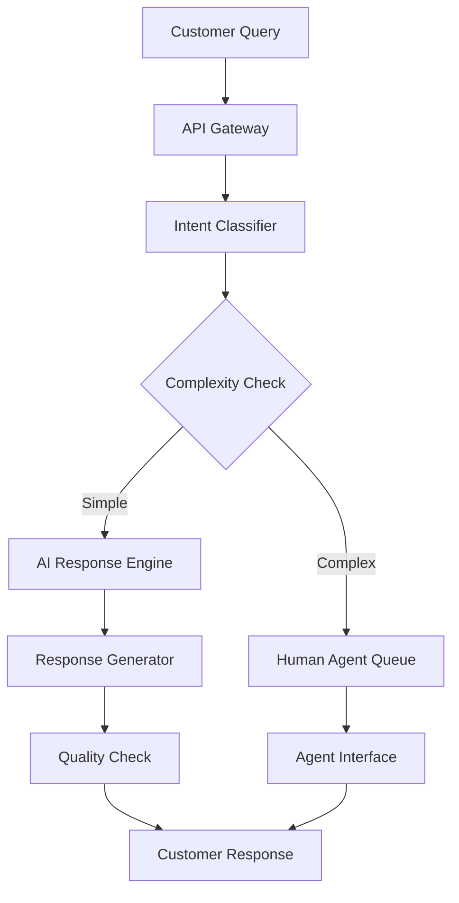

## Project Overview

We developed a comprehensive AI-powered customer service automation platform for a leading global e-commerce company serving millions of customers across 50+ countries. The solution combines advanced natural language processing with intelligent routing to deliver instant, accurate responses while seamlessly escalating complex issues to human agents.

## The Challenge

Our client was struggling with:
- **Overwhelming ticket volume**: 50,000+ daily customer inquiries
- **Long response times**: Average first response time of 24 hours
- **Inconsistent service quality**: Varying response quality across agents
- **High operational costs**: Growing support team costs exceeding $10M annually
- **Language barriers**: Supporting customers in 12 different languages

## Our Solution

We implemented a multi-layered AI system that:

### Intelligent Triage System
- Automatically categorizes and prioritizes incoming requests
- Routes complex issues to specialized human agents
- Handles routine inquiries instantly

### Natural Language Understanding
- Advanced intent classification with 98% accuracy
- Context-aware responses maintaining conversation history
- Sentiment analysis for escalation triggers

### Knowledge Base Integration
- Dynamic knowledge retrieval from company documentation
- Self-learning system that improves with each interaction
- Real-time updates from product and policy changes

## Implementation Details

### Phase 1: Foundation (Weeks 1-4)
- Analyzed 500,000+ historical support tickets
- Built custom training datasets for domain-specific language
- Established integration points with existing systems

### Phase 2: Core Development (Weeks 5-12)
- Developed the AI conversation engine using GPT-4 and LangChain
- Implemented real-time translation capabilities
- Created fallback mechanisms and human handoff protocols

### Phase 3: Integration & Testing (Weeks 13-16)
- Integrated with Zendesk, Salesforce, and internal APIs
- Conducted A/B testing with 10% of traffic
- Fine-tuned response quality based on customer feedback

## Key Features

- **Instant Response Generation**: Sub-second response times for common queries
- **Contextual Understanding**: Maintains conversation context across multiple interactions
- **Smart Escalation**: Automatically detects when human intervention is needed
- **Multilingual Support**: Native support for 12 languages with cultural nuances
- **Continuous Learning**: Improves accuracy through feedback loops
- **Analytics Dashboard**: Real-time monitoring of performance metrics

## Impact & Results

The implementation delivered transformative results:

- **Response Time**: Reduced from 24 hours to under 30 seconds for 70% of inquiries
- **Cost Reduction**: Saved $2.5M annually in operational costs
- **Customer Satisfaction**: Increased CSAT scores from 72% to 95%
- **Agent Productivity**: Freed agents to handle 40% more complex cases
- **Scalability**: System handles 10x peak load without degradation

## Technical Architecture

## Lessons Learned

1. **Data Quality is Paramount**: Initial time invested in cleaning and structuring historical data paid dividends in model accuracy
2. **Gradual Rollout**: Phased deployment allowed for continuous refinement without disrupting service
3. **Human-in-the-Loop**: Maintaining human oversight ensures quality and builds trust
4. **Cultural Sensitivity**: Language translation alone isn't enough; understanding cultural context is crucial
5. **Continuous Monitoring**: Real-time performance tracking enables rapid issue identification and resolution