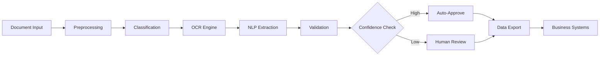

## Project Overview

We developed an intelligent document processing system for a major financial services provider handling millions of documents annually. The solution combines advanced OCR, natural language processing, and machine learning to automatically extract, validate, and process data from various document types including contracts, invoices, statements, and regulatory filings.

## The Challenge

Our client struggled with document processing inefficiencies:
- **Manual Processing Bottleneck**: 200+ employees dedicated to manual data entry
- **High Error Rates**: 5% error rate in manual extraction causing compliance issues
- **Slow Turnaround**: 48-72 hour processing time for critical documents
- **Scalability Issues**: Unable to handle peak volumes during quarter-end
- **Compliance Risks**: Manual processes increasing regulatory compliance risks

## Our Solution

We built an end-to-end intelligent document processing pipeline:

### Smart Document Ingestion
- Multi-channel document capture (email, upload, API)
- Automatic document classification and routing
- Image enhancement and preprocessing

### AI-Powered Extraction
- Advanced OCR with 99%+ character recognition
- Context-aware field extraction using NLP
- Table and form structure understanding

### Validation & Enrichment
- Cross-reference validation with existing databases
- Business rule enforcement
- Automatic error correction and flagging

## Implementation Details

### Phase 1: Discovery & Design (Weeks 1-2)
- Analyzed 100,000+ sample documents
- Identified 30+ document types and extraction requirements
- Designed validation rules and workflows

### Phase 2: Core Development (Weeks 3-8)
- Built custom OCR pipeline with pre-processing
- Trained document classification models
- Developed extraction templates for each document type

### Phase 3: Integration & Testing (Weeks 9-12)
- Integrated with existing document management systems
- Implemented security and compliance features
- Conducted parallel processing for accuracy validation

## Key Features

- **Universal Document Support**: Handles PDFs, images, scanned documents, and more
- **Template-Free Extraction**: AI learns document structures without predefined templates
- **Confidence Scoring**: Each extracted field includes confidence metrics
- **Human-in-the-Loop**: Seamless handoff for low-confidence extractions
- **Audit Trail**: Complete tracking of all processing steps
- **API-First Design**: RESTful APIs for easy integration

## Impact & Results

The system transformed document operations:

- **Processing Speed**: Reduced average processing time from 48 hours to 7 hours
- **Accuracy**: Achieved 99.2% extraction accuracy
- **Cost Reduction**: Saved $3.5M annually in operational costs
- **Scalability**: Handles 10x volume without additional resources
- **Compliance**: 100% audit trail for regulatory requirements

## Technical Architecture

## Lessons Learned

1. **Quality Over Quantity**: Better to process fewer documents accurately than many with errors
2. **Iterative Training**: Continuous model improvement based on corrections
3. **User Experience**: Simple interfaces increase adoption and reduce training time
4. **Robust Validation**: Multiple validation layers prevent downstream errors
5. **Performance Monitoring**: Real-time dashboards enable quick issue identification