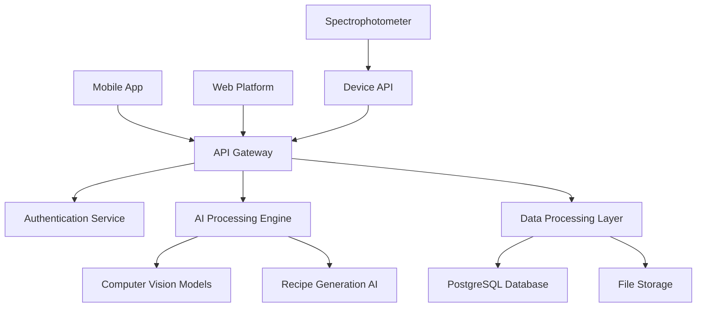

## Project Overview

We developed Matisse.ai, a comprehensive AI-powered SaaS platform that revolutionizes dental shade matching through advanced computer vision and machine learning. The platform, whose name stands for "Matching Any Tooth In Shade So Easily," combines artificial intelligence with big data analytics to help dental professionals achieve perfect color matches for ceramic restorations.

## The Challenge

The dental industry was struggling with an age-old problem that was costing practices millions and frustrating professionals worldwide. Traditional shade matching relied heavily on subjective visual assessment, where lighting conditions, individual perception, and human error created significant inconsistencies.

> **The stakes were high**: Up to 30% of restorations required costly remakes due to color mismatches, while manual shade selection processes consumed valuable chair time that could be better spent with patients.

The fundamental issue was precision. Conventional shade tabs provided insufficient granularity for the subtle color variations found in natural teeth, and disconnected systems meant that crucial data was often lost between measurement and restoration creation phases.

## Our Solution

We built a comprehensive AI-driven platform that transforms the entire shade matching workflow through three core innovations:

### 🎯 Computer Vision Engine
Our proprietary AI analyzes tooth images with surgical precision, extracting real-time L*a*b* color coordinates and processing them through deep learning models trained specifically on dental shade data. The system seamlessly integrates with leading digital spectrophotometer devices like Optishade, providing enhanced accuracy that surpasses human visual assessment.

### ⚗️ Intelligent Recipe Generation
The platform's AI calculates precise staining recipes for different restoration materials, providing systematic framework and dentin mixing recommendations. Whether handling micro-layering guidance for full monolithic cases or color correction algorithms for post-baking adjustments, the system ensures consistent, reproducible results.

### 🔗 Cross-Platform Architecture
Built for modern dental practices, our solution spans both web-based desktop platforms for comprehensive laboratory workflows and native iOS mobile apps for chairside accessibility. Real-time synchronization ensures that data flows seamlessly between platforms, backed by robust cloud infrastructure.

## Implementation Journey

Our development process followed a strategic three-phase approach over 8 months:

**Phase 1: Foundation & AI Development** *(Months 1-3)*
We began by collecting and annotating over 50,000 dental shade images, creating one of the industry's most comprehensive training datasets. Our team developed proprietary computer vision algorithms specifically designed for dental color analysis, while simultaneously building the integration framework for professional spectrophotometer devices.

**Phase 2: Platform & User Experience** *(Months 4-6)*
With our AI models trained and tested, we focused on building user-facing platforms. This included developing a responsive React-based web application for laboratory workflows and a native Swift iOS app for chairside use. Real-time synchronization and robust cloud architecture were implemented to ensure seamless data flow across all touchpoints.

**Phase 3: Integration & Optimization** *(Months 7-8)*
The final phase centered on real-world integration and performance optimization. We partnered with leading dental equipment manufacturers like Optishade and Smile Line, conducted extensive beta testing with over 50 dental laboratories, and fine-tuned our AI algorithms based on actual usage data and user feedback.

## Platform Capabilities

### Core Features
**Precision AI Analysis** processes tooth images using advanced computer vision algorithms, while **Smart Device Integration** connects seamlessly with professional color measurement equipment. The platform's **Automated Recipe Generation** calculates precise staining formulas and mixing ratios, eliminating guesswork from the restoration process.

### User Experience
**Cross-Platform Access** provides a unified experience whether using the web application in the lab or the mobile app chairside. **Systematic Workflows** guide users through structured processes that minimize errors and improve consistency, while **Real-Time Synchronization** ensures data is always current across all devices.

### Analytics & Insights
The integrated **Performance Dashboard** delivers comprehensive reporting and tracking capabilities, helping practices monitor success rates, identify optimization opportunities, and demonstrate ROI to stakeholders.

## Transformative Impact

### Precision Revolution
The platform achieved **95% accuracy** in color matching compared to just 65% with traditional methods, representing a quantum leap in dental restoration precision. This dramatic improvement eliminated the guesswork that had plagued the industry for decades.

### Operational Efficiency
Shade selection time was **reduced by 85%** on average, freeing up valuable chair time for patient care. Participating dental laboratories saw **remake rates drop by 70%**, translating directly to cost savings and improved patient satisfaction.

### Global Adoption
Within the first year, Matisse.ai onboarded **over 10,000 dental professionals** across **15+ countries**, demonstrating the universal appeal and effectiveness of our AI-driven approach. The platform continues to expand with localized features tailored to regional practice patterns and regulatory requirements.

## Technical Architecture

The platform leverages a modern, scalable architecture:

## Technical Innovations

Our breakthrough achievements in dental AI represent significant advances in the field:

**Proprietary AI Models**: We developed the first computer vision algorithms specifically trained on dental shade data, creating a new standard for color analysis precision in dentistry. These models understand the unique optical properties of tooth enamel and dentin in ways that general-purpose AI cannot match.

**Seamless Integration**: Our robust API architecture connects effortlessly with professional dental equipment, while cross-platform synchronization ensures real-time data flow between web and mobile applications. This creates a truly unified ecosystem for modern dental practices.

**Process Transformation**: We successfully transformed subjective color matching from an art into a science, creating systematic, data-driven processes that deliver repeatable results. This represents a fundamental shift in how dental professionals approach shade selection.

**Enterprise-Scale Infrastructure**: Built on cloud-native architecture, our platform serves thousands of concurrent users while maintaining sub-second response times and 99.9% uptime reliability.

## Market Leadership

Matisse.ai has established itself as the definitive solution for AI-powered dental shade matching, serving professionals across multiple continents and setting new industry standards for precision and efficiency.

The platform has been seamlessly integrated into workflows at leading dental laboratories and practices worldwide, earning recognition from industry professionals for its role in advancing restorative dentistry. As the platform continues to evolve with new features and device integrations, it solidifies our position at the forefront of healthcare technology innovation.

> This project exemplifies our comprehensive capabilities in AI/ML development, computer vision, cross-platform SaaS architecture, and specialized healthcare technology solutions.