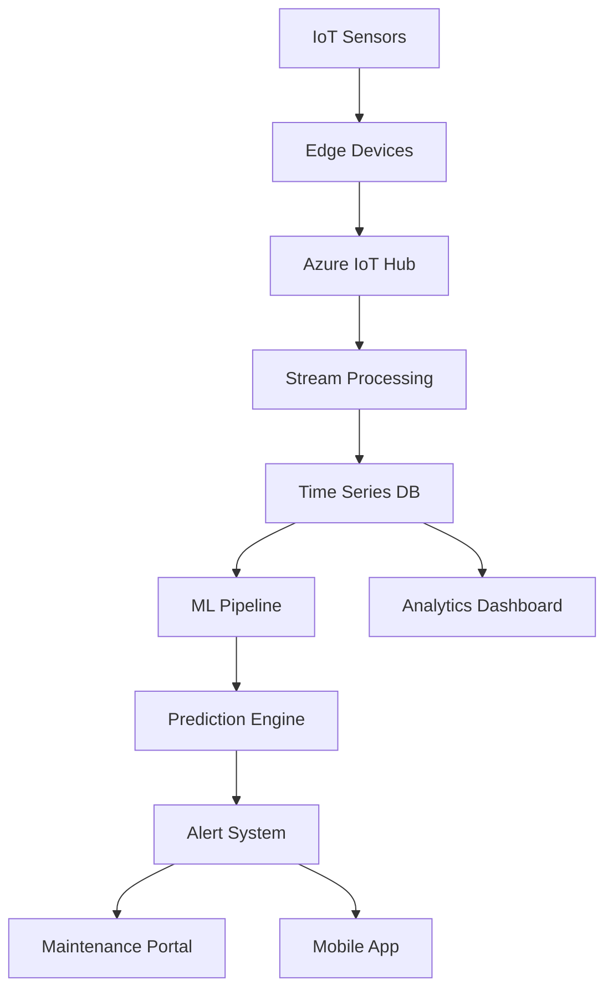

## Project Overview

We developed a cutting-edge predictive maintenance platform for a Fortune 500 manufacturing company operating 15 facilities worldwide. The solution leverages IoT sensors, machine learning, and real-time analytics to predict equipment failures before they occur, transforming reactive maintenance into proactive optimization.

## The Challenge

The manufacturing giant faced critical operational challenges:
- **Unexpected Downtime**: Equipment failures causing 2,000+ hours of unplanned downtime annually
- **Maintenance Inefficiency**: Over-maintenance wasting resources, under-maintenance risking failures
- **Lack of Visibility**: No centralized view of equipment health across facilities
- **Rising Costs**: $20M+ annual maintenance budget with increasing failure rates
- **Safety Concerns**: Equipment failures posing risks to worker safety

## Our Solution

We created an end-to-end predictive maintenance ecosystem:

### IoT Sensor Network
- Deployed 50,000+ sensors across critical equipment
- Real-time data collection at millisecond intervals
- Edge computing for immediate anomaly detection

### AI Prediction Engine
- Machine learning models trained on 5 years of historical data
- Pattern recognition across multiple sensor inputs
- Failure prediction with 92% accuracy up to 30 days in advance

### Intelligent Alert System
- Risk-based prioritization of maintenance tasks
- Automated work order generation
- Mobile notifications for field technicians

## Implementation Details

### Phase 1: Assessment & Planning (Month 1)
- Conducted equipment criticality analysis
- Identified key failure modes and patterns
- Designed sensor placement strategy

### Phase 2: Infrastructure Setup (Months 2-3)
- Deployed IoT sensors and edge devices
- Established secure data pipelines
- Set up cloud infrastructure on Azure

### Phase 3: Model Development (Months 3-5)
- Built ensemble models combining multiple algorithms
- Validated predictions against historical failures
- Fine-tuned for different equipment types

### Phase 4: Rollout & Optimization (Months 5-6)
- Phased deployment across facilities
- Training for maintenance teams
- Continuous model refinement

## Key Features

- **Real-Time Monitoring**: Live equipment health scores updated every second
- **Predictive Analytics**: Failure predictions with confidence intervals
- **Root Cause Analysis**: AI-driven diagnostics for failure patterns
- **Maintenance Optimization**: Automated scheduling based on predicted failures
- **Performance Tracking**: KPI dashboards for maintenance effectiveness
- **Integration Hub**: Seamless connection with ERP and CMMS systems

## Impact & Results

The platform delivered exceptional business value:

- **Downtime Reduction**: 45% decrease in unplanned downtime
- **Cost Savings**: $8M annual savings from optimized maintenance
- **Failure Prevention**: 200+ critical failures prevented in year one
- **Efficiency Gains**: 30% reduction in maintenance labor hours
- **Safety Improvement**: 60% reduction in equipment-related safety incidents

## Technical Architecture

## Lessons Learned

1. **Sensor Quality Matters**: Investing in industrial-grade sensors reduced false positives significantly
2. **Change Management**: Success depends on maintenance team adoption and training
3. **Start Small, Scale Fast**: Pilot program validation accelerated enterprise-wide adoption
4. **Data Governance**: Establishing data standards early prevented integration challenges
5. **Continuous Learning**: Models require regular retraining as equipment ages and conditions change