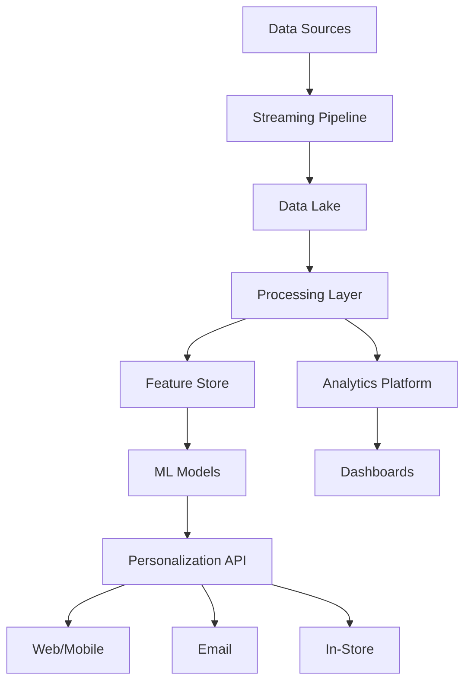

## Project Overview

We developed a comprehensive retail analytics and personalization platform for a national retail chain with 200+ stores and a growing e-commerce presence. The solution combines real-time customer behavior tracking, predictive analytics, and AI-driven personalization to deliver tailored shopping experiences across all channels.

## The Challenge

The retail chain faced significant competitive pressures:
- **Generic Customer Experience**: One-size-fits-all approach losing customers to competitors
- **Data Silos**: Customer data scattered across POS, e-commerce, and marketing systems
- **Missed Opportunities**: Unable to act on customer behavior in real-time
- **Inventory Inefficiencies**: Poor demand forecasting leading to stockouts and overstock
- **Marketing Waste**: Broad campaigns with low ROI and engagement

## Our Solution

We created an integrated analytics and personalization ecosystem:

### Unified Customer Data Platform
- Real-time data ingestion from all touchpoints
- Single customer view across online and offline channels
- Behavioral tracking and session reconstruction

### AI-Powered Personalization Engine
- Dynamic product recommendations
- Personalized pricing and promotions
- Content customization based on preferences

### Predictive Analytics Suite
- Demand forecasting by location and SKU
- Churn prediction and prevention
- Lifetime value optimization

## Implementation Details

### Phase 1: Data Integration (Month 1)
- Connected 15+ data sources
- Built real-time streaming pipelines
- Created unified customer profiles

### Phase 2: Analytics Foundation (Months 2-3)
- Developed core analytics dashboards
- Implemented customer segmentation
- Built behavioral analysis tools

### Phase 3: Personalization Engine (Months 3-4)
- Trained recommendation models
- Implemented A/B testing framework
- Deployed real-time decisioning

### Phase 4: Optimization & Scale (Month 5)
- Performance tuning for millions of users
- Advanced features and refinements
- Team training and handover

## Key Features

- **360° Customer View**: Complete profile with purchase history, preferences, and behaviors
- **Real-Time Recommendations**: Product suggestions updated with every interaction
- **Dynamic Segmentation**: Automatic customer grouping based on behavior patterns
- **Predictive Insights**: Forecasts for demand, churn, and customer value
- **Omnichannel Orchestration**: Consistent experience across web, mobile, and stores
- **Campaign Intelligence**: Automated campaign optimization and targeting

## Impact & Results

The platform delivered exceptional business outcomes:

- **Revenue Growth**: $15M additional revenue in year one
- **Conversion Rate**: 35% increase in online conversion
- **Average Order Value**: 28% increase through personalized upselling
- **Customer Retention**: 42% improvement in repeat purchase rate
- **Marketing Efficiency**: 60% increase in campaign ROI

## Technical Architecture

## Lessons Learned

1. **Start with Quick Wins**: Early successes in email personalization built stakeholder confidence
2. **Privacy First**: Transparent data practices increased customer trust and opt-in rates
3. **Test Everything**: A/B testing revealed surprising customer preferences
4. **Cross-Functional Teams**: Success required collaboration between IT, marketing, and operations
5. **Continuous Optimization**: Regular model updates maintained performance as behaviors evolved