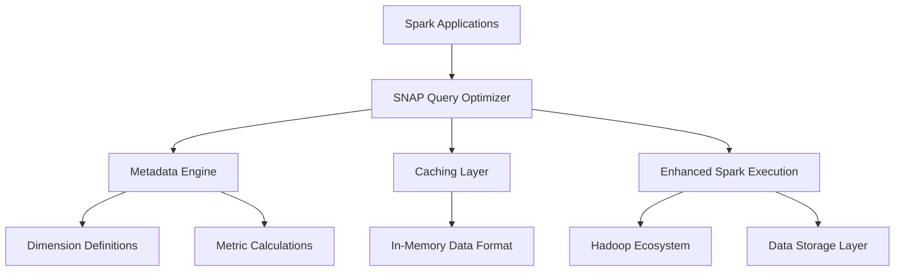

## Project Overview

We developed the SparklineData SNAP platform, an Apache Spark enhancement designed to improve big data analytics performance. SNAP (Spark Native Analytics Platform) optimizes query performance for complex analytical workloads, reducing query times and improving resource utilization.

## The Challenge

Enterprise organizations were struggling with the inherent limitations of standard Apache Spark for complex analytical queries. While Spark excelled at processing large datasets, it fell short when it came to interactive analytics and multidimensional queries that business users demanded.

> Complex analytical queries were taking longer than acceptable for interactive analysis, impacting analyst productivity and delaying business insights.

Traditional Spark deployments lacked the sophisticated optimization needed for OLAP-style workloads, and existing solutions required complete platform migrations that were costly and disruptive to established data pipelines.

## Our Solution

We built SNAP as a comprehensive enhancement layer that supercharges Apache Spark through three core innovations:

  

    <h3>High-Speed In-Memory Architecture</h3>
    +
  

  

    
Our proprietary in-memory data format combined with intelligent caching algorithms dramatically reduces data access times. The system automatically identifies frequently-accessed data patterns and optimizes storage layouts for maximum performance.

    

      <h4>Key Features:</h4>
      <ul>
        <li>Proprietary columnar storage format</li>
        <li>Intelligent data prefetching</li>
        <li>Adaptive compression algorithms</li>
        <li>Memory-aware query planning</li>
      </ul>
    

  

  

    <h3>Smart Query Optimization</h3>
    +
  

  

    
SNAP features an advanced query optimizer specifically designed for multidimensional and hierarchical data structures. The platform understands OLAP-style queries and automatically rewrites them for optimal execution paths.

    

      <h4>Optimization Techniques:</h4>
      <ul>
        <li>Cost-based query planning</li>
        <li>Predicate pushdown optimization</li>
        <li>Join order optimization</li>
        <li>Aggregation pushdown</li>
      </ul>
    

  

  

    <h3>Intelligent Metadata Integration</h3>
    +
  

  

    
The platform allows users to define dimensions, metrics, and hierarchies that create semantic understanding of data structures, enabling the optimizer to make intelligent decisions about query execution strategies.

    

      <h4>Metadata Capabilities:</h4>
      <ul>
        <li>Semantic layer definition</li>
        <li>Hierarchical data modeling</li>
        <li>Automatic relationship discovery</li>
        <li>Query context optimization</li>
      </ul>
    

  

## Implementation Journey

Our development process followed a systematic four-phase approach over 12 months:

**Phase 1: Performance Analysis & Architecture** *(Months 1-3)*
We conducted comprehensive performance profiling of existing Spark deployments, identified bottlenecks in analytical workloads, and designed our enhancement architecture to address these specific limitations without requiring platform migrations.

**Phase 2: Core Engine Development** *(Months 4-7)*
The team built our proprietary in-memory data format and caching system, developed the advanced query optimizer, and created the metadata management framework that enables semantic query understanding.

**Phase 3: Integration & Compatibility** *(Months 8-10)*
We ensured seamless integration with major Hadoop and Spark distributions, built comprehensive APIs for existing data pipeline integration, and developed monitoring and management tools for production deployments.

**Phase 4: Performance Optimization & Testing** *(Months 11-12)*
The final phase focused on real-world performance validation, fine-tuning optimization algorithms based on diverse workload patterns, and conducting extensive testing with enterprise data volumes and complexity.

## Platform Capabilities

### Core Performance Features

- **Intelligent Caching** - Automatically identifies and optimizes frequently-accessed data patterns
- **Advanced Query Optimization** - Rewrites complex analytical queries for optimal execution  
- **In-Memory Processing** - Dramatically reduces data access latency for interactive analytics
  
### Semantic Data Understanding

- **Dimension Definition** - Specify search parameters and hierarchical relationships
- **Metric Calculations** - Provide predefined analytical functions
- **Hierarchy Management** - Create structured data relationships for intuitive drill-down analytics
  
### Enterprise Integration

- **Seamless Spark Integration** - Works with existing Spark deployments without migration
- **Hadoop Ecosystem Support** - Ensures compatibility with established big data infrastructure  
- **API-First Architecture** - Enables integration with existing data pipelines and BI tools

## Transformative Impact

### Performance Improvements
SNAP achieved notable performance improvements for analytical workloads, reducing query times through intelligent caching and optimization strategies.

### Operational Benefits
Complex queries see reduced processing times, enabling analysts to work more efficiently and iterate on their analyses more quickly.

### Strategic Value Creation
Organizations using SNAP report dramatic improvements in data team productivity, faster time-to-insight for critical business questions, and the ability to implement real-time analytics use cases that were previously impossible with their existing infrastructure.

## Technical Architecture

The SNAP platform leverages a sophisticated enhancement layer:

## Technical Innovations

Our breakthrough achievements in Spark optimization represent significant advances in big data analytics:

**Query Optimization**: We developed specialized optimization techniques for OLAP-style workloads on Apache Spark, improving performance for multidimensional queries.

**Revolutionary Caching Architecture**: Our intelligent caching system goes beyond simple data storage to understand query patterns and data relationships, automatically optimizing for the most common analytical access patterns in enterprise environments.

**Seamless Enhancement Integration**: Unlike competitive solutions requiring complete platform migrations, SNAP works as a transparent enhancement layer that integrates with existing Spark deployments, preserving investments in established data infrastructure.

**Semantic Metadata Framework**: We created a comprehensive system for describing data relationships, metrics, and hierarchies that enables the platform to make intelligent optimization decisions based on business context rather than just technical query structure.

## Market Impact

SparklineData SNAP provides a practical solution for improving Apache Spark analytics performance, helping organizations better utilize their existing big data infrastructure.

The platform has been deployed in enterprise environments where analytical performance improvements can enhance business operations and analyst productivity.

> This project demonstrates our deep expertise in distributed systems optimization, big data architecture, performance engineering, and enterprise-scale platform development.