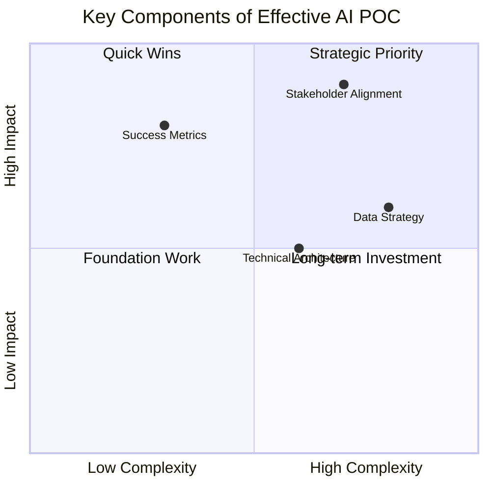
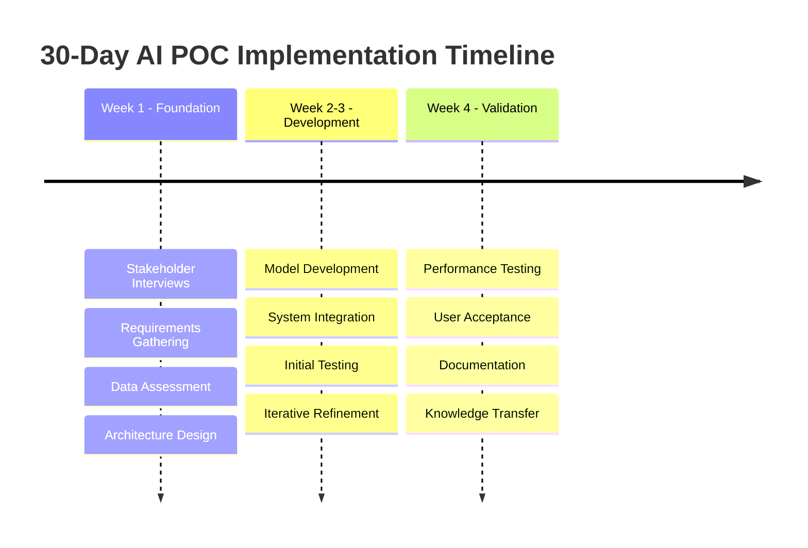
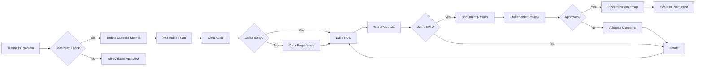
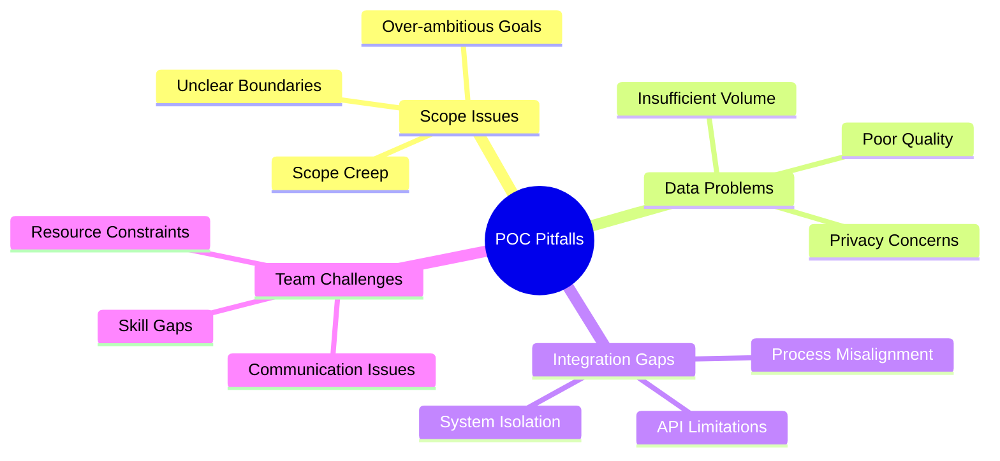
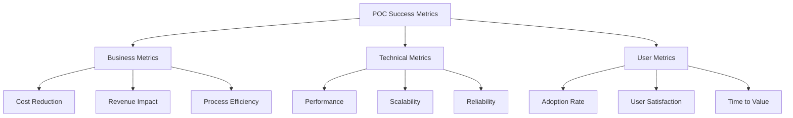

## The Foundation of Successful AI Transformation

When enterprises embark on AI transformation, the proof of concept (POC) phase is often the make-or-break moment. A well-executed POC doesn't just demonstrate technical feasibility—it proves business value, builds stakeholder confidence, and creates a roadmap for scaling.

## Key Components of an Effective AI POC

### Essential Elements:

- **Clear Success Metrics**: Quantifiable KPIs and performance thresholds
- **Stakeholder Alignment**: Buy-in from executives, end users, IT, and compliance teams
- **Data Strategy**: Quality assessment, privacy compliance, and pipeline design
- **Technical Architecture**: Scalable and maintainable system design

## The 30-Day POC Framework

## The POC Journey: From Concept to Production

## Common Pitfalls and How to Avoid Them

## Measuring Success and ROI

A successful POC demonstrates:
- **Measurable improvement** in defined KPIs
- **User adoption** with positive feedback
- **Technical viability** for enterprise scaling
- **Clear ROI projections** for full implementation

## Next Steps: Your Path to AI Success

With a strategic POC approach, enterprises can confidently move from concept to production with:
- Proven business case backed by real metrics
- Validated technical approach ready for scaling
- Full stakeholder buy-in and enthusiasm
- Clear roadmap for enterprise-wide deployment

Ready to start your AI transformation? Contact us to discuss how a strategic POC can accelerate your enterprise AI journey.