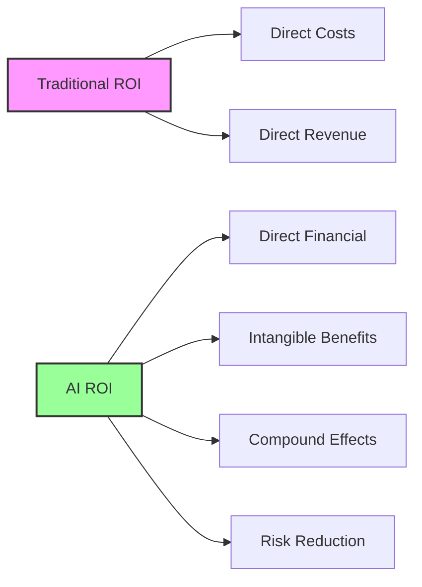
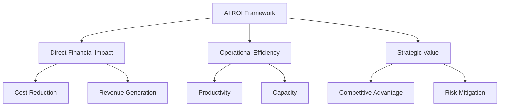
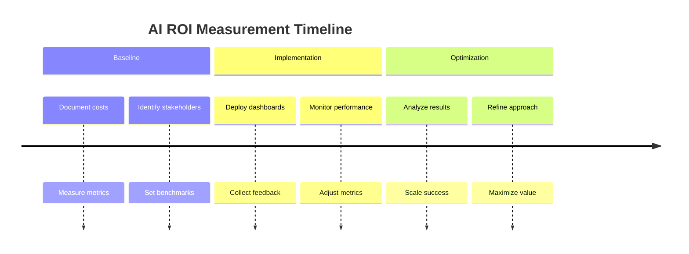
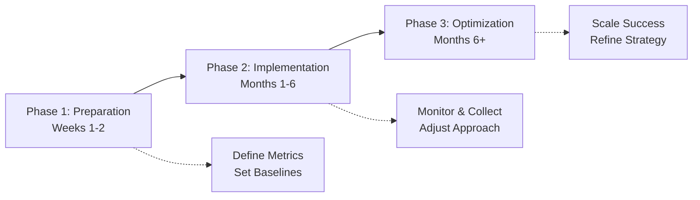
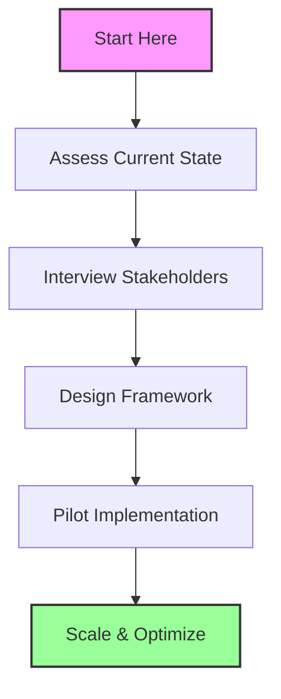

## Why AI ROI Measurement Matters

Enterprise AI initiatives require significant investment in technology, talent, and transformation. Companies with systematic ROI measurement see 23% higher success rates and 31% better resource allocation efficiency.

## The Challenge of Traditional ROI Models

Traditional ROI calculations fall short for AI because:
- **Intangible benefits** are hard to quantify
- **Compound effects** create value over time
- **Indirect impacts** create hidden value
- **Risk reduction** is difficult to measure

## A Comprehensive AI ROI Framework

### 1. Direct Financial Impact

**Cost Reduction Metrics:**
- Process automation savings (hours → dollars)
- Error reduction impact (mistakes prevented × cost per mistake)
- Resource optimization (infrastructure, personnel)

**Revenue Generation Metrics:**
- New revenue streams enabled by AI
- Customer acquisition improvements
- Upselling/cross-selling optimization

### 2. Operational Efficiency Gains

**Productivity Metrics:**
- Time-to-decision improvements
- Process speed increases
- Quality enhancements

**Capacity Metrics:**
- Throughput increases
- Scalability improvements
- Resource utilization optimization

### 3. Strategic Value Creation

**Competitive Advantage:**
- Market positioning improvements
- Customer satisfaction gains
- Innovation acceleration

**Risk Mitigation:**
- Compliance cost avoidance
- Security incident prevention
- Regulatory preparedness

## Implementation Best Practices

### Baseline Establishment
- Document current process costs
- Measure existing performance metrics
- Identify all touchpoints and stakeholders

### Continuous Measurement
- Real-time performance dashboards
- Regular stakeholder surveys
- Quarterly business impact reviews

### Attribution Analysis
- Control group comparisons
- Time-series analysis
- Multivariate statistical models

## Real-World ROI Examples

**Manufacturing Company:**
- **Investment**: $2.3M AI implementation
- **Returns**: $8.1M annual savings (predictive maintenance)
- **ROI**: 252% first-year ROI

**Financial Services Firm:**
- **Investment**: $1.8M fraud detection system
- **Returns**: $12.4M prevented fraud losses
- **ROI**: 589% first-year ROI

**Healthcare Organization:**
- **Investment**: $3.2M diagnostic AI
- **Returns**: $5.7M efficiency gains + immeasurable patient outcomes
- **ROI**: 78% measurable ROI (excluding patient outcome value)

## Common ROI Measurement Mistakes

1. **Only measuring cost savings** while ignoring revenue generation
2. **Short-term focus** missing long-term compound benefits
3. **Ignoring change management costs** in ROI calculations
4. **Failing to account for learning curves** during initial deployment

## Building Your ROI Measurement Plan

### Phase 1: Preparation (Weeks 1-2)
- Define success metrics aligned with business objectives
- Establish measurement infrastructure
- Set baseline performance levels

### Phase 2: Implementation (Months 1-6)
- Deploy continuous monitoring systems
- Collect quantitative and qualitative feedback
- Adjust metrics based on learnings

### Phase 3: Optimization (Months 6+)
- Identify optimization opportunities
- Scale successful implementations
- Refine measurement approaches

## Tools and Technologies for ROI Tracking

- **Dashboard Solutions**: Custom analytics, BI integration, real-time monitoring
- **Data Collection**: Automated metrics, user feedback, process mining

## Future-Proofing Your ROI Strategy

- **Emerging value streams**: New AI capabilities create new opportunities
- **Ecosystem effects**: Impact extends beyond initial scope  
- **Compound benefits**: Long-term value exceeds projections

## Getting Started

1. **Current state assessment** of your AI initiatives
2. **Stakeholder interviews** to identify value sources
3. **Measurement framework design** tailored to your needs
4. **Pilot implementation** with one high-impact use case

Contact our team to maximize your AI ROI with proven frameworks and expertise.